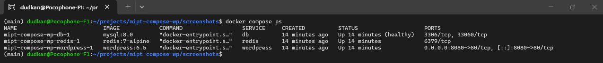
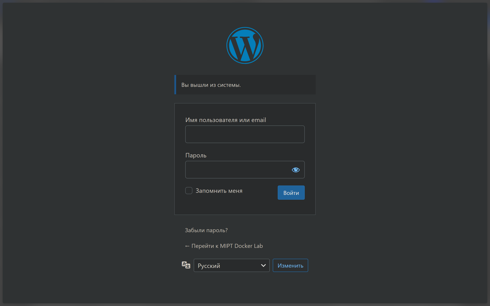

# MIPT Docker Lab: WordPress CMS Infrastructure

## Описание проекта
Этот проект представляет собой автоматизированное развертывание полноценной блог-платформы на базе **WordPress**. Инфраструктура включает в себя три ключевых компонента, работающих в связке: сам движок CMS, базу данных MySQL для хранения контента и кэш-сервер Redis для ускорения работы сайта. 

Проект реализован с помощью **Docker Compose**, что позволяет запустить всю систему одной командой, обеспечивая правильный порядок старта сервисов и сохранность данных.

## Стек технологий
* **CMS:** WordPress 6.5 (Official Image)
* **Database:** MySQL 8.0
* **Cache:** Redis 7-alpine
* **Orchestration:** Docker Compose

---

## Вариант задания
Выбран **Вариант 1**, так как он позволяет продемонстрировать навыки оркестрации нескольких готовых сервисов, настройки механизмов проверки «здоровья» (healthchecks) и управления зависимостями между контейнерами.

---

## Инструкция по запуску

Для запуска проекта на чистой машине с установленным Docker выполните следующие команды:

1. **Клонирование репозитория:**
   ```bash
   git clone https://github.com/Dudkanist/MIPT-docker-homework-3.git
   cd MIPT-docker-homework-3
   ```

2. **Подготовка окружения:**
   ```bash
   cp .env.example .env
   ```

3. **Запуск инфраструктуры:**
   ```bash
   docker compose up -d
   ```

---

## Проверка работоспособности

1. **Веб-интерфейс:** Откройте [http://localhost:8080](http://localhost:8080) — вы должны увидеть страницу установки WordPress.
2. **Статус контейнеров:** ```bash
   docker compose ps
   ```
   *Все три контейнера должны иметь статус `running`, а база данных `mysql` — статус `healthy`.*
3. **Проверка томов:**
   ```bash
   docker volume ls | grep mysql_data
   ```

---

## Технические подробности реализации


### 1. Сохранность данных (Volumes)
Для предотвращения потери данных при удалении контейнеров используются именованные тома (Named Volumes):
* `mysql_data` — хранит все таблицы базы данных, настройки и посты.
* `wordpress_data` — хранит загруженные файлы, темы и плагины.

### 2. Политика перезапуска
Для всех сервисов установлена политика **`unless-stopped`**. Это гарантирует, что сайт автоматически поднимется после перезагрузки сервера или сбоя Docker-демона, если только он не был остановлен вручную.

### 3. Интеллектуальный запуск (Healthcheck)
Одной из главных проблем связки PHP+DB является попытка приложения подключиться к еще не прогрузившейся базе. В данном проекте это решено:
* В сервисе **MySQL** настроен `healthcheck`, который проверяет готовность базы с помощью `mysqladmin ping`.
* Сервис **WordPress** имеет инструкцию `depends_on` с условием `service_healthy`. Это заставляет сайт ждать полной готовности базы перед стартом.


### 4. Безопасность
Все чувствительные данные (пароли, логины) вынесены в файл `.env`. 
* Файл `.env` добавлен в `.gitignore` и не попадает в публичный репозиторий.
* Для ознакомления со списком необходимых переменных предоставлен шаблон `.env.example`.

---

## Скриншоты работы приложения

### 1. Статус контейнеров (docker compose ps)
Здесь видно, что все сервисы запущены, а база данных прошла проверку здоровья (healthy).
<p align="center">
  
</p>

### 2. Страница установки WordPress
Подтверждение того, что веб-сервер работает и успешно подключился к базе данных.
<p align="center">
  
</p>
